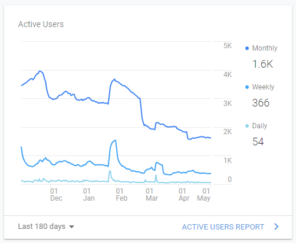
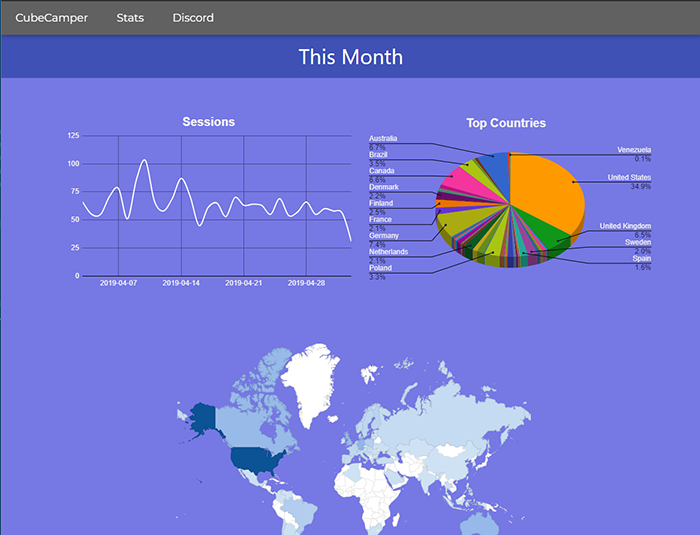
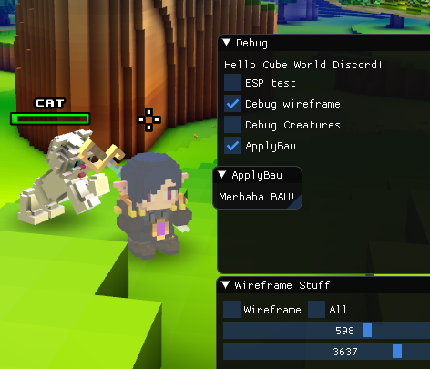

# Cube World Community Projects

Not: Bu görselde oyunun grafik çatısına müdahele ederek oyunun çizdirme modunu "wireframe" moduna çevirdim ve kendi menülerimi çizdirdim.

### Linkler:

[Cube World Subreddit](https://www.reddit.com/r/CubeWorld/) : https://www.reddit.com/r/CubeWorld/

[CubeCamper](https://humanova.github.io/cubecamper/) : https://humanova.github.io/cubecamper/

[Cube Camper GitHub Repo](https://github.com/humanova/cubecamper) : https://github.com/humanova/cubecamper

[Graphics Reverse Engineering](https://www.youtube.com/watch?v=0J-E0h3YZ1U) : https://www.youtube.com/watch?v=0J-E0h3YZ1U

[GRE GitHub Repo](https://github.com/humanova/CubeWorld-ESP) : https://github.com/humanova/CubeWorld-ESP

### İçerik:
*	[Cube World ve Topluluğu](#cube-world-ve-topluluğu)
*	[Cube Camper Web Sitesi](#cube-camper-web-sitesi)
*	[Cube World Blackboxing ve Modlar](#cube-world-blackboxing-ve-modlar)

## Cube World ve Topluluğu
---

**Cube World**, geliştiricisi tarafından 5 senedir güncelleme almayan ancak hala aktif bir topluluğa sahip yüksek potansiyelli bir **Action RPG** oyunu. Cube World subredditi toplam **27 bin kullanıcı** ve yüzlerce günlük aktif kullanıcıya sahip. Aynı zamanda bu topluluğun 16 bin kullanıcısı olan bir Discord sunucusu da bulunmakta.

Bu topluluk adına çeşitli projelere yardımlarda bulundum ve aynı zamanda kendim bir şeyler ürettim. Oyunun **tersine mühendisliği** ve **modlanması**, aynı zamanda çeşitli **web uygulamaları** ile ilgilendim. Bu nedenle bu oyun topluluğunda önemli bir statü elde ettim. (Aynı zamanda, bu büyük toplulukta 'göstermelik' bir VIP rolüm de var.)

## Cube Camper Web Sitesi
---

Ağustos 2018'de **Cube Camper** isimli basit bir Web Sitesi yazdım ve GitHub pages üzerinden yayınladım. Bu web sitesinin amacı resmi Cube World hesaplarını tek bir sayfa üzerinden kontrol edebilmek. Neden kontrol edilmesi gerek? Çünkü oyunun geliştiricisi **Wolfram Von Funck**, oyuna gelecek sonraki güncelleme hakkında çeşitli hesaplarından düzenli olmayan gönderiler yayınlıyor ve oyunu güncellemiyor. (Topluluğun da bu duruma tepkisi büyük tabii ki.) Ben de, insanların her hesabı tek tek kontrol etmesi yerine, tek sayfa üzerinden tüm hesaplardaki güncellemeleri görebilmesi adına bu siteyi yazdım ve Reddit topluluğunda yayınladım. Yayınladığım gönderim ertesi gün bu 27 bin kişilik toplulukta başa tutturulan bir gönderi oldu. (Hala aynı şekilde 'stickied' bir gönderi.)

<video width="400" height="300" controls>
  <source src="cube/cubecamper.mp4" type="video/mp4">
</video>

Cube Camper hala daha aktif kullanılan bir site. Son Analytics verilerine göre Geçen ay **65 farklı ülkeden**, 1962 görüntülenme aldı. **Aylık 1600**, haftalık ise **360 aktif kullanıcısı** var.

Bu istatistiklerin bir kısmını ise Cube Camper'ın **"Stats"** sayfasında yayınlıyorum. (Grafikler saatte bir güncelleniyor.)

## Cube World Blackboxing ve Modlar
---

Cube World'e uzun süre güncelleme gelmeyince, oyuncular da çeşitli hataları çözmek ve oyunda iyileştirmeler yapmak adına **tersine mühendislik** ile çeşitli modlar üretmeye başladı. Çokça insanın yardımıyla **CUWO**(Özel Cube World Serverı) projesi ve diğer projeler yazıldı. 

Ben de önce kendi çapımda ufak hileler ve tweakler yazdım. Ardından insanlarla iletişime geçip mod yazmaya heveslendim ve Cube World'un Grafik API'ı olan **DirectX9**'ın çeşitli fonksiyonlarıyla oynayarak(Detouring) kendi **ImGui** menümü Cube World üzerine çizdirdim. Bu menü üzerinden çeşitli tweakleri ve diğer şeyleri test ettim.

