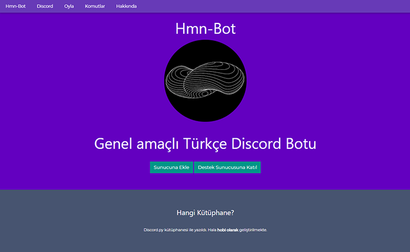
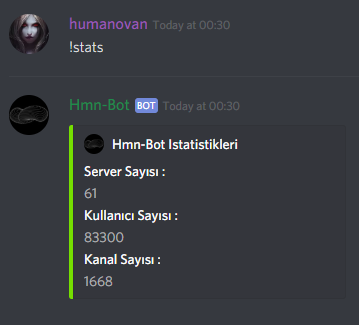
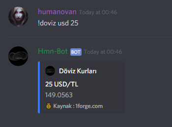
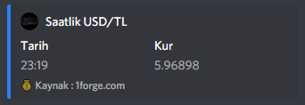
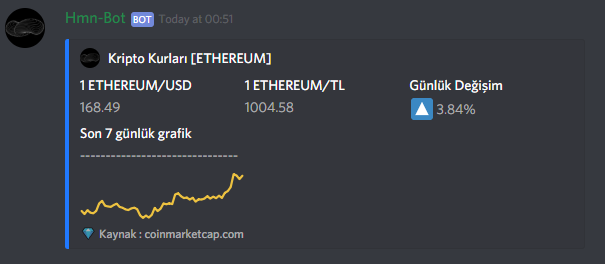
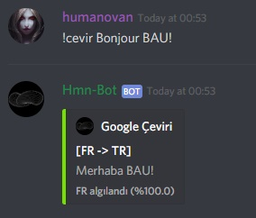
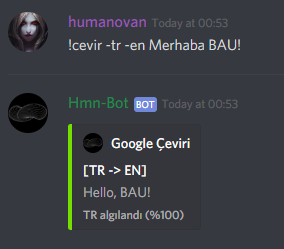
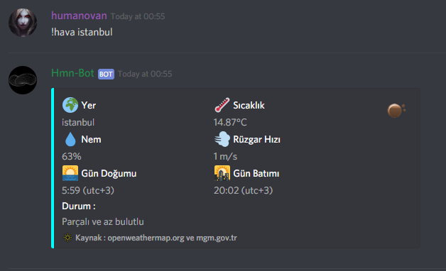
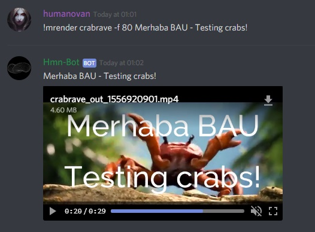

# Hmn-Bot Discord Bot

### Linkler:

[Hmn-Bot Website](https://humanova.github.io/hmnbot/index) : https://humanova.github.io/hmnbot/index

[Hmn-Bot GitHub Repo](https://github.com/humanova/Hmn-Bot) : https://github.com/humanova/Hmn-Bot

### İçerik:
*	[Nasıl Başladım?](#nasıl-başladım)
*	[Uyguladıklarım](#uyguladıklarım)
*	[Özellikler](#özellikler)

## Nasıl Başladım
---

Haziran 2018'de **hobi olarak** Hmn-Bot'u yazmaya başladım. Hala herhangi bir **ücret almadan**, arkadaş topluluklarım ve kendim adına bu botu geliştirmekteyim.

Neden bot yazmak istedim? Daha önce hiç bir online servis/bot yazma gibi bir tecrübem olmamıştı. Çeşitli oyuncu ve yazılım topluluklarında sıkça kullandığım bu platform üzerinde bot yazmam, bir anlamda işlerimi kolaylaştırabilir diye düşündüm. Aynı zamanda kendimce küçük bir online servis oluşturmamın eğlenceli ve öğretici olacağını düşündüm. Bu şekilde Python **discordpy** modülü ile Hmn-Bot'u geliştirmeye başladım.

## İstatistikler
---

Hmn-Bot şuanda 61 sunucuda **83 binden fazla** kullanıcıya hizmet vermekte. Ancak aktif olarak kullanıldığı 10'un üzerinde sunucu var. Bu servisi hobi olarak geliştirdiğim için benim için sayıların önemi yok. İçinde bulunduğum, arkadaş-oyuncu topluluklarında kullanılan ve bu topluluklar adına geliştirdiğim bir bot Hmn-Bot.

## Uyguladıklarım
---
Bu projemi geliştirirken bilmediğim birkaç teknolojiyi öğrendim ve uyguladım. **PostgreSQL** database sistemi, **Web Scraping** ile veri çekme ve işleme, **API**'lar aracılığıyla veri çekme ve işleme, **ffmpeg** ile online rendering yapma, **asenkron** servis yönetme ve loglama.
## Özellikler
---

Bazı sıkça kullanılan ya da dikkat çeken özellikler: 

### Döviz - Kripto para kurlarını API'lar ve Web Scraping aracılığıyla çekme-gösterme.

### Google Translate aracılığıyla Discord üzerinden yazılan mesajlara çeviri servisi sağlama.

### İstenilen konum için hava durumu verilerini çekip gösterme. (Eğer konumunuz MGM'nin servisinde varsa hem Openweathermap hava verilerini hem de o anki türkçe hava yorumunu gösteriyor.)

### Redditteki çeşitli "meme" topluluklarından popüler gönderileri çekip sunma.

### Online video rendering yapma.(Bazı hazır videolar üzerine yazı yazdırıp, bu videoları Discord sunucusuna yükleme.)

