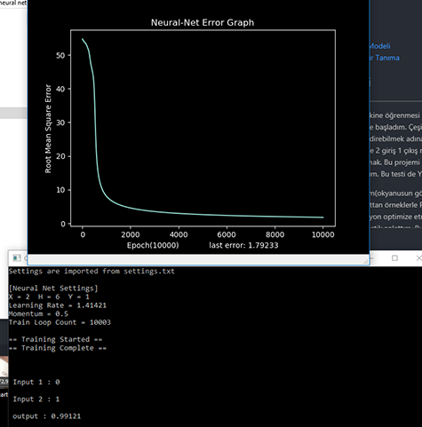
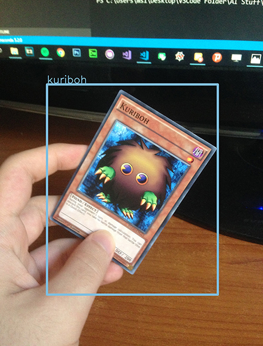
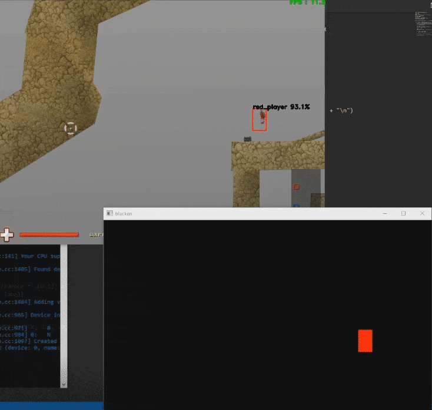

# Image Recognition Projects

### Linkler:

[YuGiOh Card Recognition](https://www.youtube.com/watch?v=-SH2JJEXSmM) : https://www.youtube.com/watch?v=-SH2JJEXSmM

[YuGiOh Dataset](https://github.com/humanova/yugioh-dataset) : https://github.com/humanova/yugioh-dataset

[Real-Time Soldat Player Detection](https://www.youtube.com/watch?v=1grKeWkst5I) : https://www.youtube.com/watch?v=1grKeWkst5I

[Soldat Dataset Tool](https://github.com/humanova/soldat-cam-stabilizer) : https://github.com/humanova/soldat-cam-stabilizer

[Simple Neural Net](https://github.com/humanova/simple-neural-net) : https://github.com/humanova/simple-neural-net

[NN Benchmark](https://www.youtube.com/watch?v=xAhWS8l8JZ4) : https://www.youtube.com/watch?v=xAhWS8l8JZ4

### İçerik:
*	[Makine Öğrenmesi](#makine-öğrenmesi)
*	[YuGiOh Kart Tanıma Modeli](#yugioh-kart-tanıma-modeli)
*	[Soldat Real-Time Figür Tanıma](#soldat-real-time-figür-tanıma)

## Makine Öğrenmesi
---

Mayıs-Haziran 2018 gibi makine öğrenmesi ve derin öğrenme üzerine merağım nedeniyle bu konular hakkında öğrenmeye başladım. Çeşitli online kurslar, videolar ve makaleler okumamın ardından öğrendiklerimi sindirebilmek adına sıfırdan kendi basit neural ağımı yazdım. C++ ile yazdığım bu ağ 3 katmanlı ve 2 giriş 1 çıkış nöronuna sahip. Ağın amacı XOR işleminin sonucunu doğru vermeye optimize olmak. Bu projemi GitHub üzerinde yayınladım ve bu ağı kullanarak basit bir benchmark hazırladım. Bu testi de Youtube'da paylaştım.

Aynı zamanda bu öğrendiğim(okyanusun görünür kısmı) konuyu Matematik dersimde kendi örneklerimle ve gerçek hayattan örneklerle Proje konum olarak sundum. **Cost Fonksiyonu**, **Gradient Descent** ile fonksiyon optimize etme ve **Yapay Sinir Ağları** hakkında sunumumda detaylı bir şekilde matematik ve istastik anlattım. Bu sunumuma aşağıdaki adresten erişebilirsiniz :). 

[Makine Öğrenmesi Sunumu](https://drive.google.com/open?id=1e7K_sxOyaU4e1akAUMyWp4fy3-HCl3cJ) : https://drive.google.com/open?id=1e7K_sxOyaU4e1akAUMyWp4fy3-HCl3cJ

## YuGiOh Kart Tanıma Modeli
---

Yapay sinir ağları üzerine öğrenmemin ve basit bir ağ oluşturup uygulamamın ardından **Convolutional Neural Network**(CNN) denilen ağ yapılarıyla ilgilenmeye başladım. Bu ağ yapısı görüntü tanıma modellerinin olmazsa olmazı bir yapı. 

Ben de kendi görüntü tanıma modelimi oluşturabilmek adına **YOLO** görüntü tanıma algoritması hakkında araştırmaya başladım. YOLO **Joseph Redmon**(pjreddie) tarafından geliştirilen, çok hızlı ve tutarlı bir görüntü tanıma algoritması. Çok hızlı olmasının bir sebebi de hem sınıflandırmayı(classification) hem de sınırlamayı(localising) aynı CNN ağı içinde yapıp bitirmesi. İsmi de buradan geliyor : _"You Only Look Once"_.

Ağustos 2018'de, verisini kendim topladığım ve etiketlediğim(labeling) 1300 fotoğraflık veri setimi oluşturdum. Ve bu veri setimle, önceden eğitilmiş _`tiny_yolo_voc`_ ağırlıklarının üzerine kendi modelimi eğittim. Modelimi eğitebilmek için "**darkflow**" isimli, Python **darknet** implementasyonunu kullandım.

Bu model yalnızca 3 görüntü tanıyabilmek için eğitildi. Bu görüntüler : Kart arkalığı, Kuriboh kartı ve Mystical Elf kartı.

## Soldat Real-Time Figür Tanıma
---

YuGiOh kart tanıma modelimin ardından yine aynı algoritma ile farklı bir görüntü tanıma modeli oluşturmaya karar verdim. Gerçek zamanlı olarak, Soldat isimli oyundaki oyuncu figürleri tanıyan bir model eğittim. 

Modelimi eğitebilmek için oyundaki figüreleri farklı varyasyonlarda fotoğraflayıp, etiketlemem gerekiyordu. Bunu otomatikleştirebilmek adına, oyunun kamera konumunu sabitleyen ve Python ile oyunun penceresinden görüntü toplayan bir tool oluşturdum. Oyunun kamera açısını sabitleyebilmek için oyun belleğine müdahele etmem gerekti. Bunu da basit tersine mühendislik bilgilerimi kullanarak, C++ ile kamera konumunun tutulduğu bellek adresine uzaktan müdahele eden bir uygulama yazarak çözdüm. Python scriptini ve C++ uygulamasını GitHub'da yayınladım. Dileyen herkes bu dataset oluşturma toolunu kullanarak kendi Soldat verisetini oluşturabilir.

